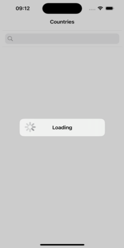
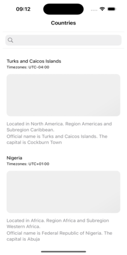
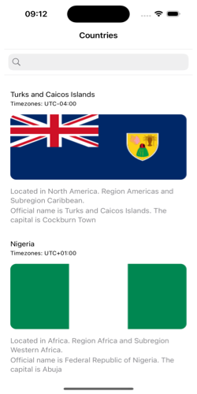
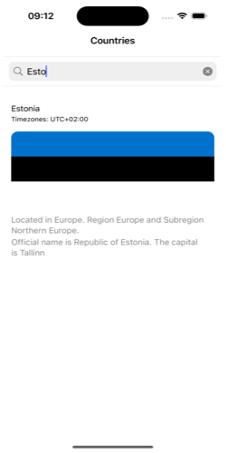
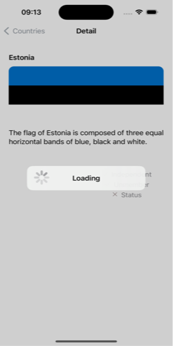
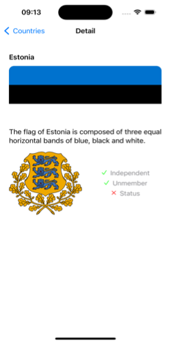

# CountryListApp
Appplication para mostrar el listado de Países en un tableView, junto con una barra de busqueda que actualiza la lista por cada caracter agregado o eliminado. Al hacer click en un pais, este muestra el detalle d dicho pais en una nueva vista. Durante los tiempos de carga se muestra una pantalla de loading.

La applicacion esta desarrollada en Xcode 15.0.1 para iOS 17.0. Sin frameworks de terceros o dependencias lo cual facilita la compilacion del mismo en el schenme: CounrtyListApp

Requisitos:
- Agregar una vista cargando inicial
- Listar países con la posibilidad de busqueda por nombre
- Cada vez que un usuario ingresa o elimina un caracter de busqueda, la lista debe actualizarse
- Pruebas unitarias
- Pantalla de detalle 

Se decició utilizo MVVM pattern por el tamaño del projecto y los side effects que estos requerian (modulo de network desde servidor). Se combino con Composite pattern para tener el codigo mejor desacoplado y las responsabilidades de cada elemento separada. Para garantizar que ciertas ejecuciones que deban afectar la UI despues de un proceso background se implemento Decorate Pattern. 

Las imagenes dentro de cada País cuentan con un efecto adicional de carga shimmering dentro de su propio contenedor esto debido a que la vista de cargando es para la carga de datos en general y la respuesta de carga de imagenes no deberia obstaculizar con la experiencia de usuario y la veloocidad que se le puedan presentar los datos. Adicionalmente estas imagenes cuentan con un botton de reintento cuando estas cargas fallan. 
Las imagenes tambien cuentan con un CancelTask cuando estas se encuentran solicitando la imagen al servidor y la celda pasara a dejar de presentarse, preparandola para su reutlizacion y previniendo que no haya conflictos con la presentacion de imagenes cuando se realizan scrolls bastante largos. Ademas como no habia solicitud de almacenarlo en un cache las imagenes se opto por guardar las imagenes InMemory para mejorar la experiencia de usuario y la performance de la app.

Se considero realizar la implementacion de la UI por codigo pero dado a que es un proyecto simple y no se realiza el dearrollo con un equipo (previniendo errores dentro de los archivos de vistas) se utilizo StoryBoards con su interface builder haciendola esta mas facil de entender y visualizar los elementos dentro de cada vista para una presentacion. 

Para la pantalla de detalle tambien se utilizo un TableView dado a que el servicio retorna una lista de items, y es posible que retorne detalle de varios a la vez. 
Para textos de 

Screens capture:
Country List View / Loading state:

Country List View / Image Shimmering Loading

Country List View / Loading Completed

Country List View / Search Bar filter

Detail View / Loading

Detail View / Loading Complete

